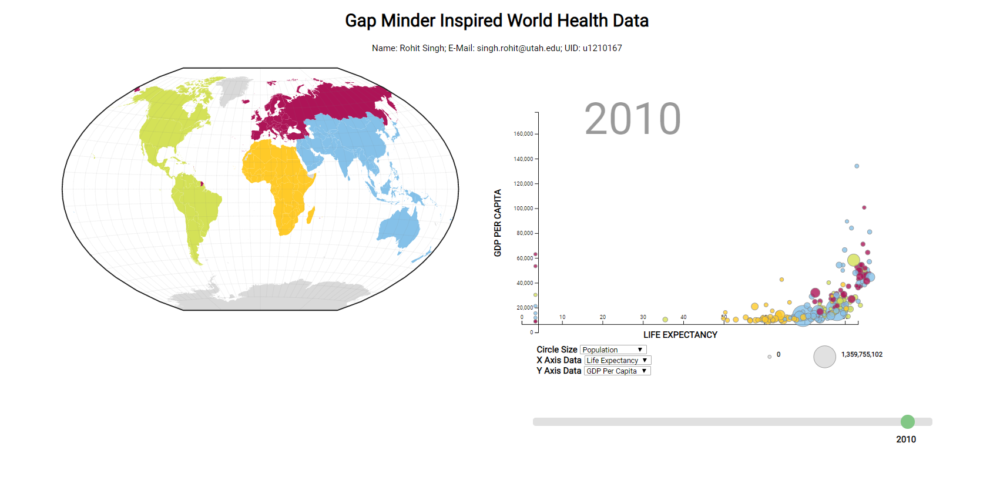
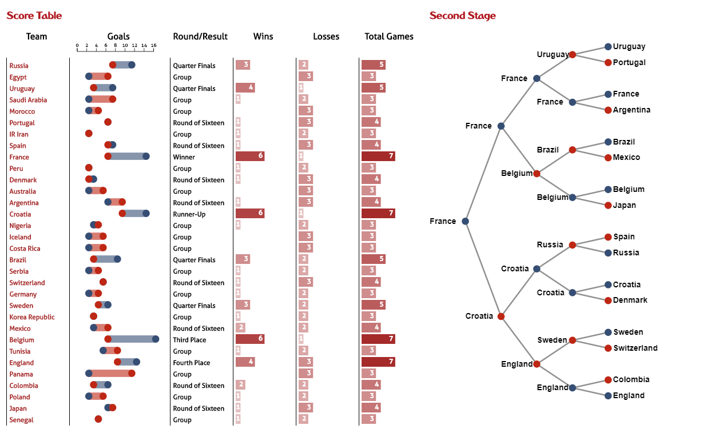
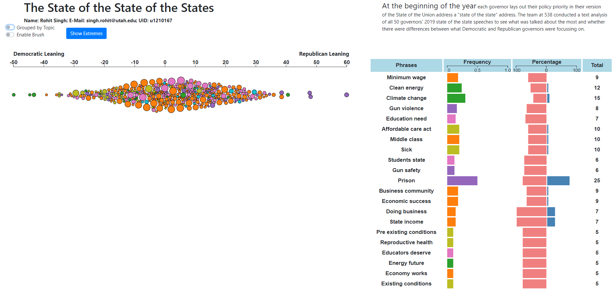

# Visualization for Data Science

These are three mini projects I completed as part of CS6630 Visualization for Data Science course Fall 2019 at the University of Utah. Technologies used consist of JavaScript, D3JS, HTML and CSS. The source code repositories have to be kept private but you can view the final visulization designs at the links below:
 
## Links

[1. World Health Data](https://rohit200792.github.io/gap-minder-visualization/)

[2. Fifa World Cup 2018](https://rohit200792.github.io/fifa-wc-2018/)

[3. State of State Addresses in 2019](https://rohit200792.github.io/vis-state-of-states/)

## Note
Currently the implementations are checked for compatiblity only against Chrome Browser and a screen reolution of 3840 by 2160. I plan to work on ensuring cross browser compatiblity and make them responsive. But until then please adjutst the browser window by zooming out untill all visualization components fit. Here are screenshots to each for reference:

### World Health Data

### Fifa World Cup 2018

### State of State Addresses in 2019

